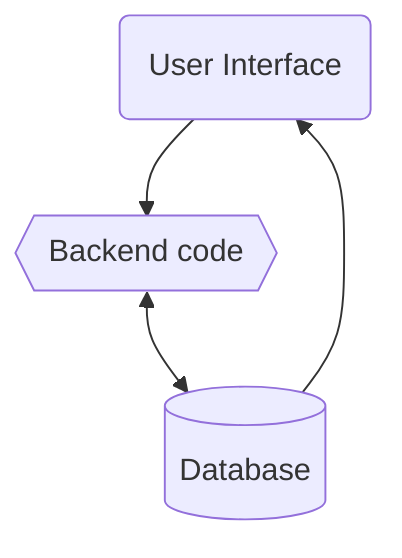

# Software Design Document: The Weary Traveler

## Architectural Design

The Weary Traveler is a python application that shows the user various profit making methods for Path of Exile and their up-to-date margins. The app is build up of three parts: UI, backend code, and database. The UI can be used to select different groups of profit making strategies, which show up in a list that is sorted by the most profitable methods. The backend code uses the official poe.trade api to update the profit margins according to the PoE market. Market values of each profit method are stored in the database by the backend code and is visualized UI.

## High-level Design

## Detailed Design