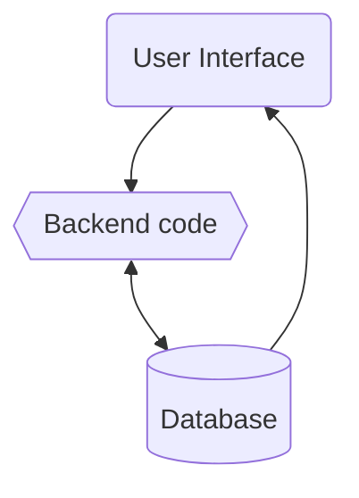
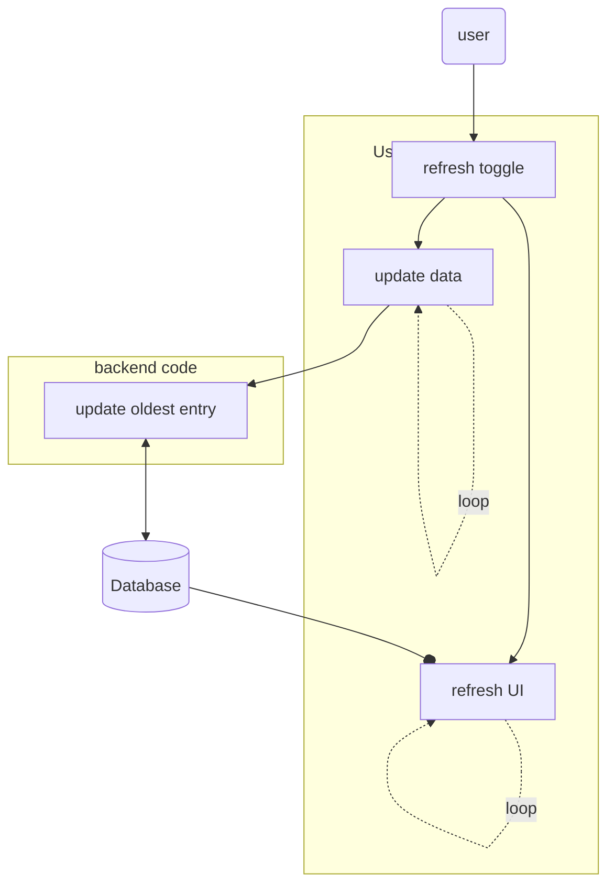
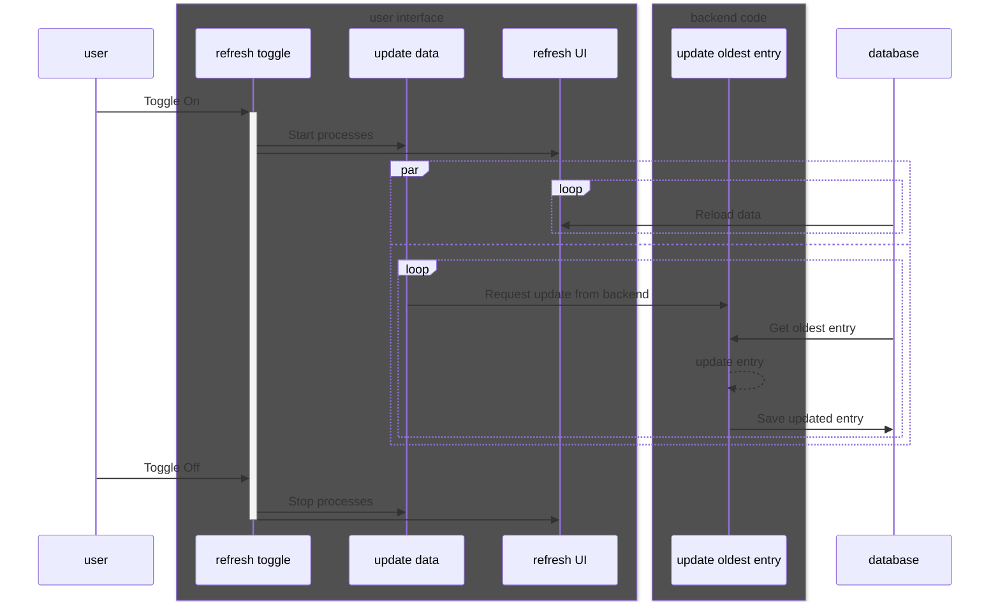

# Software Design Document: The Weary Traveler

## Architectural Design

The Weary Traveler is a python application that shows the user various profit making methods for Path of Exile and their up-to-date margins. The app is build up out of three parts: the user interface (UI), the backend code, and the database. The UI can be used to select different groups of profit making strategies, which show up in a list that is sorted by the most profitable method. The backend code uses the official poe.trade api to update the profit margins according to the PoE market. Market values of each profit method are stored in the database by the backend code and are visualized in the UI.

## High-level Design
The user interface displays a table of profit making methods, which can be refreshed automatically. The user is able to toggle the refresh functionality from the UI. With the refresh toggle enabled, the user interface engages two background processes, one to update the data in the database and another to regularly refresh the UI with the new data. The update Data process calls the backend code periodically to update the oldest entry and store the updated entry in the database.

### High-level flow chart

### High-level sequence diagram

## Detailed Design

### User Interface
The user interface is a single window containing a dropdown menu, a button, and a table overview. 
* The dropdown menu can be used to select different groups of profit methods from the database. 
* The button can be used to toggle the automatic update background process. 
* The table overview lists the profit methods with the following fields:
  * Item Name
  * Buy price
  * Sell price
  * Profit
  * Time since last update

### Backend code

### Database
The database is represented as a collection of comma separated value files, each file storing the information of all entries within a profit method group. Each entry corrosponds with one line in the .csv file and consists of the following information:
* (string) Item Name
* (float) Buy price
* (float) Sell price
* (float) Profit
* (datetime as text) Time of last update

The time of last update is stored as text with the following format: 2024-03-20 21:22:29.