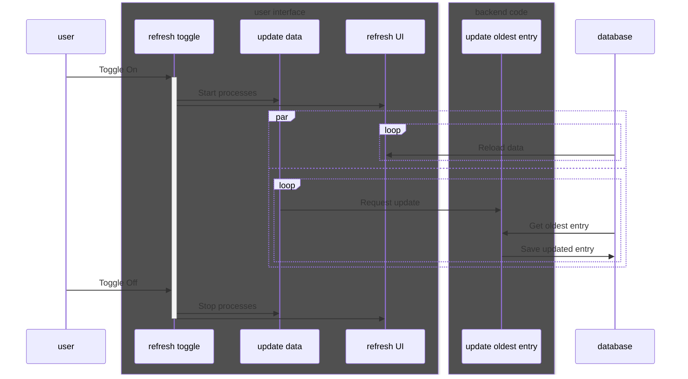

# Software Design Document: The Weary Traveler

## Architectural Design

The Weary Traveler is a python application that shows the user various profit making methods for Path of Exile and their up-to-date margins. The app is build up out of three parts: the user interface (UI), the backend code, and the database. The UI can be used to select different groups of profit making strategies, which show up in a list that is sorted by the most profitable method. The backend code uses the official poe.trade api to update the profit margins according to the PoE market. Market values of each profit method are stored in the database by the backend code and are visualized in the UI.

## High-level Design
The user interface displays a table of profit making methods, which can be refreshed automatically. The user is able to toggle the refresh functionality from the UI. With the refresh toggle enabled, the user interface engages two background processes, one to update the data in the database and another to regularly refresh the UI with the new data. The update Data process calls the backend code periodically to update the oldest entry and store the updated entry in the database.

### High-level flow chart

### High-level sequence diagram

## Detailed Design